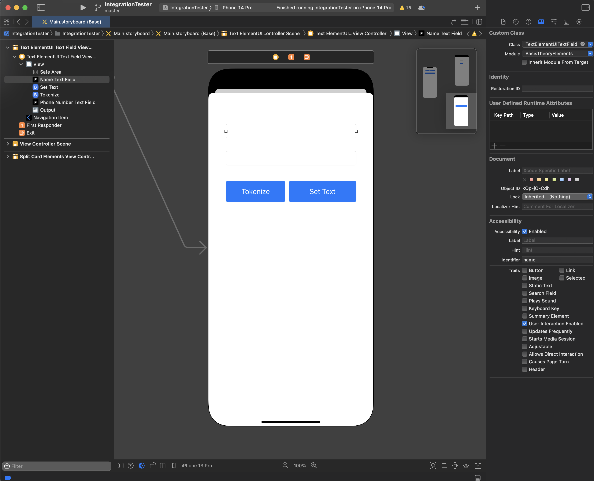

# basistheory-ios

**Basis Theory Elements** are simple, secure, developer-friendly inputs that empower consumers to collect sensitive data from their users directly to Basis Theory’s certified vault.

Think about it as a portal that we open within your mobile app that allows users to seamlessly tokenize information and never notice they are interacting with our technology. Here is how we make it possible:

- Own your UX, by fully customizing how **Elements** are styled
- Use inputs and forms with ease
- Interact with Elements just like native elements

## Installation

### Swift Package Manager

#### Via Xcode

Add through Xcode via _File -> Add Packages_. Search for "https://github.com/Basis-Theory/basistheory-ios" and click on "Copy Dependency".

#### Via Package.swift

Add the following line under `dependencies` to your `Package.swift`:

```swift
    .package(url: "https://github.com/Basis-Theory/basistheory-ios", from: "X.X.X"),
```

And add `BasisTheoryElements` as a dependency to your `target`:

```swift
    dependencies: [
        .product(name: "BasisTheoryElements", package: "basistheory-ios"),
        ...
    ],
```

### CocoaPods

Add the following line to your `Podfile` under your `target`:

```ruby
    pod 'BasisTheoryElements'
```

## Initialization

To initialize our elements, you’ll need to set a custom class on each of the UITextFields that need to be configured as one of our secure elements. Below is an example of a UITextField set as `TextElementUITextField`:



## Customizing Elements

All of our elements have been designed to take advantage of the pre-existing native properties and customizations built directly into the [UIKit framework](https://developer.apple.com/documentation/uikit). 

### **Styling Elements**

Utilizing the same configuration as [UIKit framework](https://developer.apple.com/documentation/uikit), you’re able to customize the styling of your `TextElementUITextField` as you would with any other UITextField. For example:

```swift
textElementUITextField.layer.cornerRadius = 15.0
textElementUITextField.placeholder = placeholder
textElementUITextField.backgroundColor = UIColor( red: 240/255, green: 240/255, blue: 240/255, alpha: 1.0 )
```

## Element Configuration

The following options are available to be set via the `setConfig` function on the [TextElementUITextField](#textelementuitextfield) element:

| Fields | Description |
| --- | --- |
| mask | An array that restricts and fills user input. More info here. |
| transform | A struct that takes in an `NSRegularExpression` and a `String` to modify your value before making a tokenization request. More info here. |

### Mask

[TextElementUITextField](#textelementuitextfield)’s can restrict and fill user input by using the `mask` attribute. It consists of an array of `NSRegularExpression` objects and `Strings`, used to restrict and fill input, respectively. The position of each item in the mask array corresponds to the restriction or fill used for that input's position. The length of the array determines how long an input is allowed to be. For example, the mask for a US based phone number shown below will have the following rules:

```swift
let regexDigit = try! NSRegularExpression(pattern: "\\d")
let phoneMask = [ //(123)456-7890
	"(",
  regexDigit,
  regexDigit,
  regexDigit,
  ")",
  regexDigit,
  regexDigit,
  regexDigit,
  "-",
  regexDigit,
  regexDigit,
  regexDigit,
  regexDigit
] as [Any]
myTextElement.setConfig(options: TextElementOptions(mask: phoneMask))
```

- The input must be at most 13 characters long
- Only digits are allowed in the 2-4, 6-8, 10-13 positions
- '(' will be filled in the 1 position
- ')' will be filled in the 5 position
- '-' will be filled in the 8 position

The mask will be displayed as the user is typing, and will be used as the value for [tokenization](#tokenize) performed with that text element. If the value does not satisfy the mask in its entirety, the field is considered incomplete. This is reflected in the [element events](#elementevent) and will fail validation before [tokenization](#tokenize).

### Transform

[TextElementUITextField](#textelementuitextfield)’s allow you to modify user input before [tokenization](#tokenize) through the **`transform`** attribute. It’s a struct that takes in an `NSRegularExpression` and a `String`. It works by making use of the [stringByReplacingMatches](https://developer.apple.com/documentation/foundation/nsregularexpression/1413740-stringbyreplacingmatches) function on the `NSRegularExpression` provided. If no string is defined, an empty string will be used as the argument for `withTemplate`. For instance, the mask for a US based phone number shown below will modify user input to look like this: **`(123)456-7890`**. The **`transform`** setting set below, in this case, will modify the user input to remove **`(`**, **`)`**, and **`-`** from the input. The resulting value is **`1234567890`** which will be what gets [tokenized](#tokenize).

```swift
let regexDigit = try! NSRegularExpression(pattern: "\\d")
let phoneMask = [ //(123)456-7890
	"(",
  regexDigit,
  regexDigit,
  regexDigit,
  ")",
  regexDigit,
  regexDigit,
  regexDigit,
  "-",
  regexDigit,
  regexDigit,
  regexDigit,
  regexDigit
] as [Any]

textElementUITextField.setConfig(options: TextElementOptions(mask: phoneMask, transform: ElementTransform(matcher: transformMatcher))
```

🚨 If no `transform` is set, the value is sent to be tokenized as is, including the `mask` if set.

## Element Modified and Additional Fields

`BasisTheoryElements` package’s elements are a simple wrapper for the native UIKit [UITextField](https://developer.apple.com/documentation/uikit). This enables developers to take full advantage of existing native customization, while also restricting their system access to the underlying data.

| Fields | Description |
| --- | --- |
| text | We restrict the getter for this value; it always returns nil. The setter works as is. |
| subject | An instance of PassThroughSubject that allows you to subscribe to ElementEvents. |

## ElementEvent

Events are triggered whenever a user types into an element textfield. An `ElementEvent` is the struct that gets passed into the [subject](#element-modified-and-additional-fields)’s `receiveValue` function. The following are properties on the `ElementEvent` struct:

| Property | Description |
| --- | --- |
| type | The event type for the `ElementEvent`. As of today it’s just `textChange`. |
| complete | Whether the input is `valid` and the `mask` is satisfied. |
| valid | Whether the input is `valid` according to `validation` for each element. |
| details | An array of [ElementEventDetail](#elementeventdetail) describing more information about the element event. |

### ElementEventDetail

| Property | Description |
| --- | --- |
| type | A `String` describing the type of detail. As of today, it is `cardBrand`. |
| message | A `String` containing the message for the detail. |

## Element Instances

### TextElementUITextField

The `TextElementUITextField` element type enables collecting user **`String`** data. [Masking and transform](#element-configuration) capabilities are available to be configured on these elements.

| Configuration | Overridable | Defaults |
| --- | --- | --- |
| validation | ❌ | No default `validation`. Always valid in [ElementEvent](#elementevent). |
| mask | ✅ | No default `mask`.  |
| transform | ✅ | No default `transform`. |

### CardNumberUITextField

The `CardNumberUITextField` element type renders a card number input featuring automatic brand detection, input validation, and masking.

| Configuration | Overridable | Defaults |
| --- | --- | --- |
| validation | ❌ | Input must be Luhn valid and be an acceptable length for the card brand. |
| mask | ❌ | The `mask` changes depending on the card brand identified for this input. Most commonly it will contain a space every 4 digits up to the 16th digit. |
| transform | ❌ | All spaces set by the `mask` above will be removed before tokenization. |

### CardExpirationDateUITextField

The `CardExpirationDateUITextField` element type features a month and year formatted input with validation. 

| Configuration | Overridable | Defaults |
| --- | --- | --- |
| validation | ❌ | Input must be the current month and year or later. |
| mask | ❌ | Two digits followed by a forward slash followed by two more digits (eg. `MM/YY` ). |
| transform | ❌ | No default `transform`. |

#### Month and Year

Both the month and year values need to be be retrieved from a `CardExpirationDateUITextField` with the `month()` and `year()` functions, respectively. Below is an example:

```swift
let body: [String: Any] = [
  "data": [
	  "number": self.cardNumberTextField,
	  "expiration_month": self.expirationDateTextField.month(),
    "expiration_year": self.expirationDateTextField.year(),
    "cvc": self.cvcTextField
  ],
  "type": "card"
]
```

### CardVerificationCodeUITextField

The `CardVerificationCodeUITextField` element type is used to collect the card verification code.

| Configuration | Overridable | Defaults |
| --- | --- | --- |
| validation | ❌ | No default `validation`. Always valid in [ElementEvent](#elementevent). |
| mask | ❌ | If not associated with a `CardNumberUITextField`, the `mask` is a 4 digit number. If it is, the `mask` changes depending on the card brand identified by the `CardNumberUITextField`. Refer to the section below. |
| transform | ❌ | No default `transform`. |

#### Associating a CardNumberUITextField

Associating a `CardNumberUITextField` with a `CardVerificationCodeUITextField` will enhance masking capabilities of the CVC element. By default a `CardVerificationCodeUITextField` `mask` is a 4 digit number. But when associated with a `CardNumberUITextField`, the `mask` will change to match the card brand identified by the `CardNumberUITextField`. Below is an example of how to make that association:

```swift
cvcTextField.setConfig(
	options: CardVerificationCodeOptions(
		cardNumberUITextField: cardNumberTextField
	)
)
```

## Services

### BasisTheoryElements

This is a static class containing services available to be used with elements exported from the `BasisTheoryElements` package.

🚨 Before we make any tokenization requests, we check to ensure all of the elements being passed in are valid. If any one of them is not valid, we will return an `invalidInput` error.

#### `tokenize`

Elements' values can be securely tokenized utilizing our [tokenize](https://docs.basistheory.com/#tokenize) services. To accomplish this, simply pass the Element instance in the payload.

```swift
let body: [String: Any] = [
  "data": [
    "property": <BasisTheory Element instance>,
    "myProp": "myValue"
  ],
  "search_indexes": ["{{ data.property }}"],
  "type": "token"
]

BasisTheoryElements.tokenize(body: body, apiKey: "<YOUR PUBLIC API KEY>") 
	{ data, error in print(data) }
```

#### `createToken`

Elements' values can be securely tokenized utilizing our [createToken](https://docs.basistheory.com/#tokens-create-token) services. To accomplish this, simply pass the Element instance in the payload.

```swift
let body: CreateToken = CreateToken(type: "token", data: [
  "property": <BasisTheory Element instance>,
  "myProp": "myValue",
], searchIndexes: ["{{ data.property }}"])

BasisTheoryElements.createToken(body: body, apiKey: "<YOUR PUBLIC API KEY>") 
	{ data, error in print(data) }
```

## Full TextElementUITextField Example

The following code can be run from our [open source repo](https://github.com/Basis-Theory/basistheory-ios). Just open the `IntegrationTester.xcodeproj` file found [here](https://github.com/Basis-Theory/basistheory-ios/tree/master/IntegrationTester/IntegrationTester.xcodeproj).

```swift
//
//  ViewController.swift
//  iOSExample
//
//  Created by Brian Gonzalez on 10/18/22.
//

import UIKit
import Combine
import BasisTheoryElements

class TextElementUITextFieldViewController: UIViewController {
    private let lightBackgroundColor : UIColor = UIColor( red: 240/255, green: 240/255, blue: 240/255, alpha: 1.0 )
    private let darkBackgroundColor : UIColor = UIColor( red: 200/255, green: 200/255, blue: 200/255, alpha: 1.0 )
    private var cancellables = Set<AnyCancellable>()

    @IBOutlet private weak var nameTextField: TextElementUITextField!
    @IBOutlet weak var output: UITextView!
    @IBOutlet private weak var phoneNumberTextField: TextElementUITextField!
    
    @IBAction func printToConsoleLog(_ sender: Any) {
        nameTextField.text = "Tom Cruise"
        phoneNumberTextField.text = "555-123-4567"
        
        print("nameTextField.text: \(nameTextField.text)")
        print("phoneTextField.text: \(phoneNumberTextField.text)")
    }
    
    @IBAction func tokenize(_ sender: Any) {
        let body: [String: Any] = [
            "data": [
                "name": self.nameTextField,
                "phoneNumber": self.phoneNumberTextField,
                "myProp": "myValue",
                "object": [
                    "nestedProp": "nestedValue",
                    "phoneNumber": self.phoneNumberTextField,
                ]
            ],
            "search_indexes": ["{{ data.phoneNumber }}"],
            "type": "token"
        ]
        
        BasisTheoryElements.tokenize(body: body, apiKey: "YOUR PUBLIC API KEY") { data, error in
            guard error == nil else {
                self.output.text = "There was an error!"
                print(error)
                return
            }

            let stringifiedData = String(data: try! JSONSerialization.data(withJSONObject: data!.value as! [String: Any], options: .prettyPrinted), encoding: .utf8)!

            self.output.text = stringifiedData
            print(stringifiedData)
        }
    }

    override func viewDidLoad() {
        super.viewDidLoad()
        
        let regexDigit = try! NSRegularExpression(pattern: "\\d")
        let phoneMask = [ //(123)456-7890
            "(",
            regexDigit,
            regexDigit,
            regexDigit,
            ")",
            regexDigit,
            regexDigit,
            regexDigit,
            "-",
            regexDigit,
            regexDigit,
            regexDigit,
            regexDigit
        ] as [Any]
       
        let transformMatcher = try! NSRegularExpression(pattern: "[()-]") //Regex to remove parentheses & dashes
        let phoneOptions = TextElementOptions(mask: phoneMask, transform: ElementTransform(matcher: transformMatcher))
        
        try! phoneNumberTextField.setConfig(options: phoneOptions)
        
        setStyles(textField: nameTextField, placeholder: "Name")
        setStyles(textField: phoneNumberTextField, placeholder: "Phone Number")

        nameTextField.subject.sink { completion in
            print(completion)
        } receiveValue: { message in
            print(message)
        }.store(in: &cancellables)
    }
    
    private func setStyles(textField: UITextField, placeholder: String) {
        textField.layer.cornerRadius = 15.0
        textField.placeholder = placeholder
        textField.backgroundColor = lightBackgroundColor
        textField.addTarget(self, action: #selector(didBeginEditing(_:)), for: .editingDidBegin)
        textField.addTarget(self, action: #selector(didEndEditing(_:)), for: .editingDidEnd)
    }
    
    @objc private func didBeginEditing(_ textField: UITextField) {
        textField.backgroundColor = darkBackgroundColor
    }
    
    @objc private func didEndEditing(_ textField: UITextField) {
        textField.backgroundColor = lightBackgroundColor
    }
}
```

## Full Split Card Elements Example

The following code can be run from our [open source repo](https://github.com/Basis-Theory/basistheory-ios). Just open the `IntegrationTester.xcodeproj` file found [here](https://github.com/Basis-Theory/basistheory-ios/tree/master/IntegrationTester/IntegrationTester.xcodeproj).

```swift
//
//  SplitCardElementsViewController.swift
//  IntegrationTester
//
//  Created by Brian Gonzalez on 11/10/22.
//

import Foundation
import UIKit
import BasisTheoryElements
import Combine

class SplitCardElementsViewController: UIViewController {
    private let lightBackgroundColor : UIColor = UIColor( red: 240/255, green: 240/255, blue: 240/255, alpha: 1.0 )
    private let darkBackgroundColor : UIColor = UIColor( red: 200/255, green: 200/255, blue: 200/255, alpha: 1.0 )
    private var cancellables = Set<AnyCancellable>()
    
    @IBOutlet weak var cardNumberTextField: CardNumberUITextField!
    @IBOutlet weak var expirationDateTextField: CardExpirationDateUITextField!
    @IBOutlet weak var cvcTextField: CardVerificationCodeUITextField!
    @IBOutlet weak var output: UITextView!
    @IBOutlet weak var cardBrand: UITextView!
    
    @IBAction func tokenize(_ sender: Any) {
        let body: [String: Any] = [
            "data": [
                "number": self.cardNumberTextField,
                "expiration_month": self.expirationDateTextField.month(),
                "expiration_year": self.expirationDateTextField.year(),
                "cvc": self.cvcTextField
            ],
            "type": "card"
        ]
        
        BasisTheoryElements.tokenize(body: body, apiKey: "YOUR PUBLIC API KEY") { data, error in
            guard error == nil else {
                self.output.text = "There was an error!"
                print(error)
                return
            }
            
            let stringifiedData = String(data: try! JSONSerialization.data(withJSONObject: data!.value as! [String: Any], options: .prettyPrinted), encoding: .utf8)!
            
            self.output.text = stringifiedData
            print(stringifiedData)
        }
    }
    
    
    override func viewDidLoad() {
        super.viewDidLoad()
        
        setStyles(textField: cardNumberTextField, placeholder: "Card Number")
        setStyles(textField: expirationDateTextField, placeholder: "MM/YY")
        setStyles(textField: cvcTextField, placeholder: "CVC")
        
        cardNumberTextField.subject.sink { completion in
            print(completion)
        } receiveValue: { message in
            print("cardNumber:")
            print(message)
            
            if (!message.details.isEmpty) {
                var brandDetails = message.details[0]
                
                self.cardBrand.text = brandDetails.type + ": " + brandDetails.message
            }
        }.store(in: &cancellables)
        
        expirationDateTextField.subject.sink { completion in
            print(completion)
        } receiveValue: { message in
            print("expirationDate:")
            print(message)
        }.store(in: &cancellables)
        
        cvcTextField.subject.sink { completion in
            print(completion)
        } receiveValue: { message in
            print("CVC:")
            print(message)
        }.store(in: &cancellables)
    }
    
    private func setStyles(textField: UITextField, placeholder: String) {
        textField.layer.cornerRadius = 15.0
        textField.placeholder = placeholder
        textField.backgroundColor = lightBackgroundColor
        textField.addTarget(self, action: #selector(didBeginEditing(_:)), for: .editingDidBegin)
        textField.addTarget(self, action: #selector(didEndEditing(_:)), for: .editingDidEnd)
    }
    
    @objc private func didBeginEditing(_ textField: UITextField) {
        textField.backgroundColor = darkBackgroundColor
    }
    
    @objc private func didEndEditing(_ textField: UITextField) {
        textField.backgroundColor = lightBackgroundColor
    }
}
```
